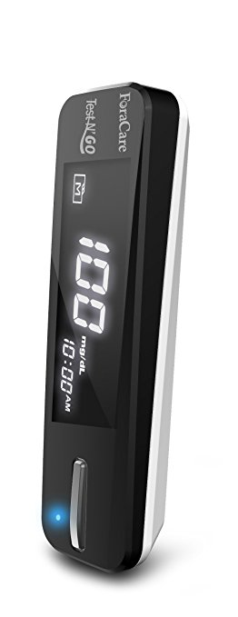

=================
Fora Diamond Mini
=================

----------------
Forensic Summary
----------------

+-----------------+----------------------------------+------------------------------+
| Category        | Feature                          | Present                      |
+=================+==================================+==============================+
| Data collection | Console/Shell                    | No                           |
|                 +----------------------------------+------------------------------+
|                 | Extractible data from memory     | Yes                          |
+-----------------+----------------------------------+------------------------------+
| Traceability /  | Real-Time Clock (RTC)            | No                           |
| Accountability  +----------------------------------+------------------------------+
|                 | System log(s)                    | No                           |
|                 +----------------------------------+------------------------------+
|                 | Event log(s)                     | No                           |
+-----------------+----------------------------------+------------------------------+
| Power management| Visual indicator                 | Yes                          |
|                 +----------------------------------+------------------------------+
|                 | Can be easily powered off        | No                           |
+-----------------+----------------------------------+------------------------------+

-------------------------------
Extracting valuable information
-------------------------------

Use `our dedicated tool <https://github.com/digitalsecurity/hfdb.io/devices/Fora/DiamondMini/`_ to extract valuable information.

First, press the button of the Fora Diamond Mini glucose monitoring system as many times as required for the blue LED to blink.
Then, use *hcitool* to scan the available devices and locate the Fora GMS device:

.. code-block:: text

    # hcitool lescan
    0B:D9:5F:8C:74:36 (unknown)
    C0:26:DF:00:67:3D DIAMOND MOBILE
    C0:26:DF:00:67:3D (unknown)
    32:BF:4E:59:00:AA (unknown)

The *DIAMOND MOBILE* device shows up, note the bluetooth address and use our dedicated tool to extract the event log:

.. code-block:: text

    # node diamondmini.js -t C0:26:DF:00:67:3D
    Number of records: 1
    Newest record index is: 0

    --- Records ----
    16/8/16 16:43 - 147 mg/dL
