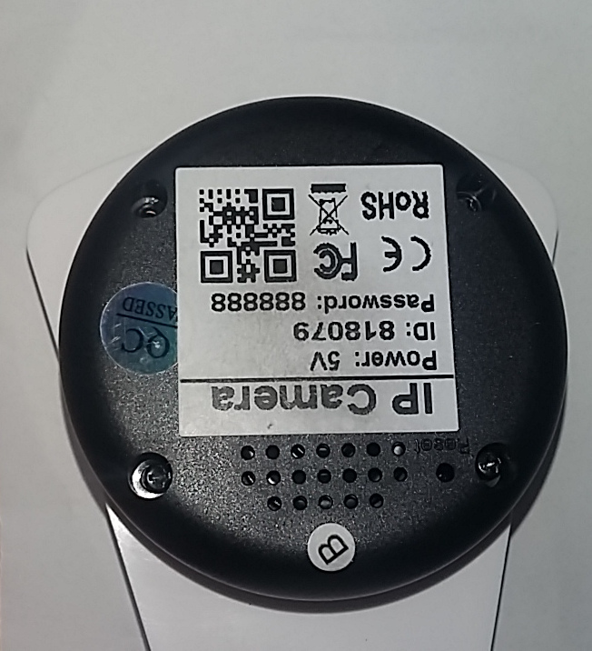
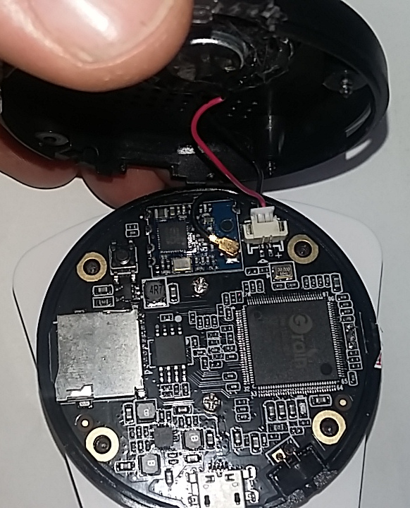
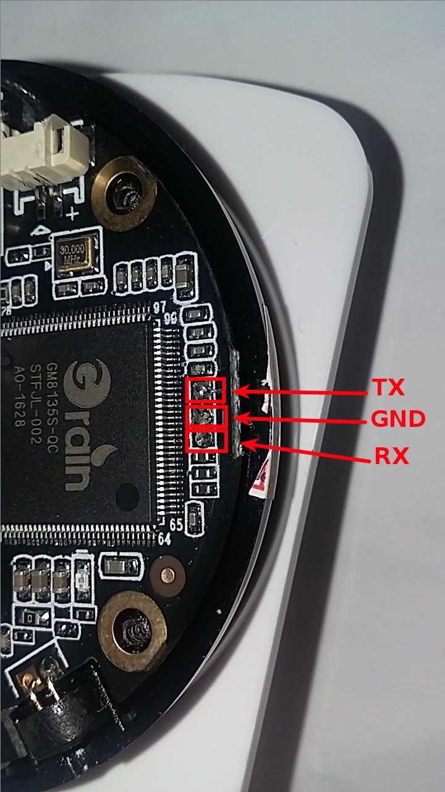

====================
Sricam IP Camera
====================

Sricam sells a Wifi enabled IP Camera. This camera is connected to the Internet wia WiFi and is remotely controlled thanks to a mobile application.

----------------
Forensic Summary
----------------

+-----------------+----------------------------------+------------------------------+
| Category        | Feature                          | Present                      |
+=================+==================================+==============================+
| Data collection | Console/Shell                    | Yes                          |
|                 +----------------------------------+------------------------------+
|                 | Extractible data from memory     | Yes                          |
+-----------------+----------------------------------+------------------------------+
| Traceability /  | Real-Time Clock (RTC)            | Yes                          |
| Accountability  +----------------------------------+------------------------------+
|                 | System log(s)                    | Yes                          |
|                 +----------------------------------+------------------------------+
|                 | Event log(s)                     | No                           |
+-----------------+----------------------------------+------------------------------+
| Power management| Visual indicator                 | No                           |
|                 +----------------------------------+------------------------------+
|                 | Can be easily powered off        | Yes, unplug USB cable        |
+-----------------+----------------------------------+------------------------------+

-------------------------
Accessing the Serial Port
-------------------------

Unscrew the 4 screws of the Sricam IP Camera.

Then, open it and disconnect the speaker.

Connect your serial adapter as shown below:

-------------------------
Serial port configuration
-------------------------

This serial port uses a baudrate of 115200 and gives a prompt directly, without authentication.

.. code-block:: text

    Boot image offset: 0x10000. size: 0x70000. Booting Image .....

    U-Boot 2013.01 (Sep 01 2005 - 02:39:21)

    DRAM:  64 MiB
    ROM CODE has enable I cache
    SPI mode
    SF: Got idcodes
    00000000: c2 20 18 c2    . ..
    SF: Detected MX25L12805D with page size 64 KiB, total 16 MiB
    flash is 3byte mode
    *** Warning - bad CRC, using default environment

    In:    serial
    Out:   serial
    Err:   serial

    -------------------------------
    ID: 8136110
    AC: 200  HC: 200  P1: 712  P2: 600  P3: 540
    C6: 712  DR: 950
    J: 237   H1: 237
    -------------------------------
    Net:   GMAC set RMII mode
    reset PHY
    eth0
    Warning: eth0 MAC addresses don't match:
    Address in SROM is         71:75:61:73:68:66
    Address in environment is  00:11:22:33:44:55

    ----------Value=0x40000000------------
    Hit any key to stop autoboot:  0
    SF: Got idcodes
    00000000: c2 20 18 c2    . ..
    SF: Detected MX25L12805D with page size 64 KiB, total 16 MiB
    flash is 3byte mode
    ## Booting kernel from Legacy Image at 02000000 ...
       Image Name:   gm8136
       Image Type:   ARM Linux Kernel Image (uncompressed)
       Data Size:    2216488 Bytes = 2.1 MiB
       Load Address: 02000000
       Entry Point:  02000040
       Verifying Checksum ... OK
       XIP Kernel Image ... OK
    OK
    Not define this ID
    : mem=64M gmmem=30M console=ttyS0,115200 user_debug=31 init=/squashfs_init root=/dev/mtdblock2 rootfstype=squashfs

    Starting kernel ...

    Uncompressing Linux... done, booting the kernel.
    Booting Linux on physical CPU 0
    Linux version 3.3.0 (user9@ubuntu) (gcc version 4.4.0 20100318 (experimental) (Buildroot 2012.02) ) #100 PREEMPT Fri May 19 05:42:19 PDT 2006
    CPU: FA6 [66056263] revision 3 (ARMv5TE), cr=0000397f
    CPU VIPT aliasing data cache, unknown instruction cache
    Machine: Grain-Media GM8136 series
    Memory policy: ECC disabled, Data cache writeback
    Built 1 zonelists in Zone order, mobility grouping on.  Total pages: 16256
    Kernel command line: mem=64M gmmem=30M console=ttyS0,115200 user_debug=31 init=/squashfs_init root=/dev/mtdblock2 rootfstype=squashfs
    PID hash table entries: 256 (order: -2, 1024 bytes)
    Dentry cache hash table entries: 8192 (order: 3, 32768 bytes)
    Inode-cache hash table entries: 4096 (order: 2, 16384 bytes)
    Memory: 64MB = 64MB total
    Memory: 60580k/60580k available, 4956k reserved, 0K highmem
    Virtual kernel memory layout:
        vector  : 0xffff0000 - 0xffff1000   (   4 kB)
        fixmap  : 0xfff00000 - 0xfffe0000   ( 896 kB)
        vmalloc : 0x84800000 - 0xff000000   (1960 MB)
        lowmem  : 0x80000000 - 0x84000000   (  64 MB)
        modules : 0x7f000000 - 0x80000000   (  16 MB)
          .text : 0x80008000 - 0x803f2f54   (4012 kB)
          .init : 0x803f3000 - 0x8040e000   ( 108 kB)
          .data : 0x8040e000 - 0x8042a700   ( 114 kB)
           .bss : 0x8042a724 - 0x8043e44c   (  80 kB)
    NR_IRQS:64
    gm_jiffies_init, system HZ: 100, pClk: 100000000
    console [ttyS0] enabled
    Calibrating delay loop... 709.42 BogoMIPS (lpj=3547136)
    pid_max: default: 32768 minimum: 301
    Mount-cache hash table entries: 512
    CPU: Testing write buffer coherency: ok
    Setting up static identity map for 0x2fcab8 - 0x2fcb00
    devtmpfs: initialized
    FMEM: 7680 pages(0x1e00000 bytes) from bank0 are reserved for Frammap.
    FMEM: Logical memory ends up at 0x84000000, init_mm:0x80004000(0x4000), PAGE_OFFSET:0x80000000(0x0),
    FMEM: FA726 Test and Debug Register: 0x0
    NET: Registered protocol family 16
    PMU: Mapped at 0xfe000000
    IC: GM8135, version: 0x1

-------------------------------
Extract information from memory
-------------------------------

Since this **camera has no logs**, the only information we can get is the usual unix-like stuff, i.e. :

  * connected users (netstat, who)
  * active processes
  * virtual memory

If the camera is connected to Internet through an existing WiFi network, its date and time are synced.
