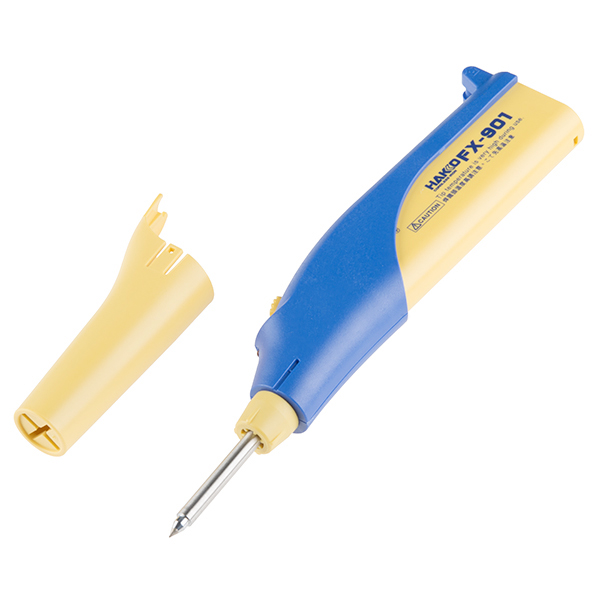

================================
IoT-related forensic methodology
================================

This section proposes a forensic methodology in order to evaluate, collect and preserve evidences from various devices.
This methodology aims at providing the most efficient way to collect valuable information from smart or connected devices,
generally small and providing a few communication means.

-------
Context
-------

Standard forensic methodologies are designed to handle incidents related to computers (servers, workstations, laptops). These systems
usually use a known operating system, combined with well-known storage devices (hard drives, SD/MMC/CF cards, etc.) that are mostly easily
available to the forensic investigator. Thus, creating a forensic images of these storage medias is quite straightforward, and various
dedicated forensic devices are available on the market.

However, embedded devices are small form-factor tiny computers, sometimes using some kind of operating system, sometimes not. Storage medias
are also quite different, as they rely on soldered NAND flash memories or even integrated flash memory that is not directly readable without
having the correct tools and procedures.

This is why we developed this methodology for the IoT forensic investigator, in order to provide him/her with the correct procedures and tools
to perform all the required tasks.

--------------------
Proposed methodology
--------------------

I.  Evaluate the device
-----------------------

I.1. Is the device powered on ?
~~~~~~~~~~~~~~~~~~~~~~~~~~~~~~~

First of all, it is important to evaluate a device before collecting information. There are basically two cases:

* the device is powered on
* the device is powered off

It is sometimes difficult to tell wether a device is powered on or off, because it may have no visual indicators. Many connected objects are
powered on by default and cannot be powered off without removing the power source (if possible), whereas they provide no visual indicators (LEDs or screens).
However, they may advertise as a bluetooth low energy device or communicate through another proprietary protocol.

I.2. Determine the device power state
~~~~~~~~~~~~~~~~~~~~~~~~~~~~~~~~~~~~~

Look for the device in the *HFDB*, it may be listed with details information about the supported communication protocols and how to evaluate the device' power state.

If not, you may try the following:

  1. Using nRFConnect application on Android, try to determine if the device is advertising itself based on the measured RSSI
  2. Interact with the device if some buttons are available, and see if it may cause some kind of reaction
  3. Read the device user manual and try to identify if there is an easy way to determine the device's power state

.. note:: Do not power on or off the device !

I.3. Collect information about the device
~~~~~~~~~~~~~~~~~~~~~~~~~~~~~~~~~~~~~~~~~

Collect the following information if available:

  * Vendor name
  * Device name
  * Serial number
  * Advertised information (Bluetooth Low Energy advertisements, WiFi beacons, etc. )
  * Device MAC address

.. note:: If the device is powered off, go to III.

II. Live analysis of a device
-----------------------------

An active device may expose valuable information that may be lost if it is powered off or
if the device is not correctly handled. This section describes a forensic process aiming at
collecting all the available information.

II.1. Using the device's features to collect data
~~~~~~~~~~~~~~~~~~~~~~~~~~~~~~~~~~~~~~~~~~~~~~~~~

Many smart/connected devices rely on a communication protocol to provide the user with useful
information as measurements, device identity, account information, etc. This communication protocol
may be used to extract valuable information while the device is active, and especially volatile information.

Using the device's features requires the forensic investigator to know how to interact with this device. The major
encountered protocols are:

  * Telnet: offers a system shell (authentication may be required)
  * SSH: offers a system shell (authentication may be required)
  * UART: may offer a shell (authentication may be required) or use a proprietary protocol
  * Bluetooth Low Energy: exposes services and characteristics may be queried to extract information (proprietary protocol sometimes)
  * WiFi: offers an API that may be queried to collect information about the device

Embedded operating systems generally provides Telnet, SSH or Serial console access while tiny smart devices rely on other proprietary protocols.
Therefore, the forensic investigator needs to reverse-engineer these proprietary protocols and develop his/her own tool to communicate with the corresponding devices.

II.2. Hot wiring a device
~~~~~~~~~~~~~~~~~~~~~~~~~

The forensic investigator may need to connect to a debug or serial port while the device is active. This may impact the device:

  * short-circuits may damage the device
  * soldering wires to a specific port may be challenging, especially with a live device

Conductive paste can be used to quickly connect wires to debug ports, whereas it requires some kind of level adaptation circuitry. This solution is quite elegant
but not very easy to use as the paste behaves as a resistor and cause voltage drops.

A portable soldering iron is another way to hot wire an active device very quickly. However, one may be careful and remove the soldermask before soldering wires to
some pads or connector footprints.

Last but not least, some devices may not allow to be open while active, in this case it is very difficult to access their internals and connect to specific ports.

II.3. Exploiting a vulnerability to gain access
~~~~~~~~~~~~~~~~~~~~~~~~~~~~~~~~~~~~~~~~~~~~~~~

In case the device features are not directly available, the forensic investigator may exploit a known vulnerability to get access to the device. This is particularly
true for devices using embedded operating systems (Linux-based mostly).

HFDB :doc:`list of supported devices <devices>` may provide some known vulnerability that may be exploited, along with working exploits.

III. Create bit-stream copies of storage medias
-----------------------------------------------

In order to preserve evidences, the forensic investigator needs to create an exact duplicata of data stored in every storage media, by doing
bit-stream copies of their contents.

Usually, the forensic investigator has to handle three categories of storage medias:

  * Internal electronic memories: Internal NAND Flash of a given SoC or MCU
  * Electronic storage chips: NAND Flash, NOR Flash
  * classic storage medias such as SD/MMC/CF cards

.. note:: This operation has to be performed on a powered off device, so make sure to cut the power if the device was found in an powered on state.

III.1. Extracting data from internal flash
~~~~~~~~~~~~~~~~~~~~~~~~~~~~~~~~~~~~~~~~~~

Internal flash memory is not directly accessible from a System-on-Chip as this latter provides an interface to access its own CPU
and acts as a relay to its internal flash memory. This behavior allows the SoC to protect its flash against firmware extraction, by enforcing
access rules based on fuse settings.

The forensic investigator has to determine the SoC or MCU reference (vendor, type of SoC or MCU, package) and search the *HFDB* about its flash memory capacity and how to extract it.

The *HFDB* provides a :doc:`comprehensive forensic summary of many SoCs and MCUs <cpumcu>`, detailing the methodology to dump each chip's internal flash memory when
it is possible.

III.2. Extracting data from external flash
~~~~~~~~~~~~~~~~~~~~~~~~~~~~~~~~~~~~~~~~~~

External flash memories are dedicated electronic chips used to store information. There are different well-known types of chips with different packages:

  * Serial NAND flash memory (SPI compatible)
  * Parallel flash memory (Easy Flash or similar)
  * eMMC (Interface similar to SD/MMC card but soldered on the PCB in a BGA package)

III.3. Extracting data from classic storage medias
~~~~~~~~~~~~~~~~~~~~~~~~~~~~~~~~~~~~~~~~~~~~~~~~~~

In case of SD/MMC cards, the extraction process is well-known and simple:

1. Use a compatible write-blocker or enable software-level write protection
2. Use a forensic tool like *dcfldd* to create a bit-stream image of the card along with SHA256 and MD5 hashes
3. Check the hashes against the original device to ensure integrity.
